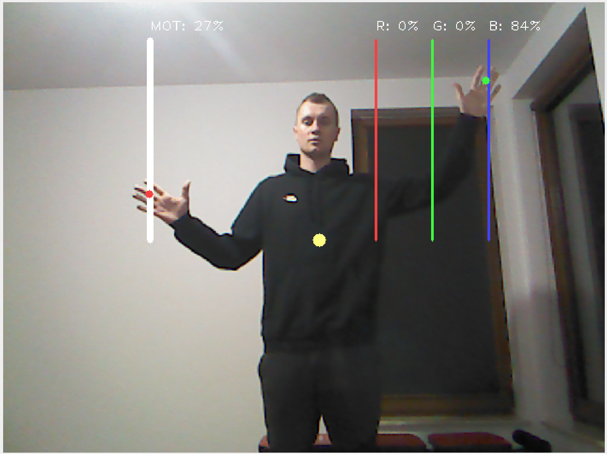

# KinectControlledEmbeddedSystem

Application enables human natural interaction with embedded system. Kinect sensor is used to capture RGB image and depth map which is then used to decompose human figure and transform into skeleton. PC and the microcontroller are communicated via serial port. 

Check ---> [Presentation Video](https://youtu.be/mrOUgTbqgY0) to see how the system works.

LIBRARIES
======
+  [__OpenNI__](https://github.com/OpenNI/OpenNI) - delivers API to work with raw depth map

+  [__NiTE__](https://github.com/arnaud-ramey/NITE-Bin-Dev-Linux-v1.5.2.23) - middleware containing a set of algorithms transforming human pose detected in depth map into skeleton assembled with links and keypoints like elbows, hands, knees, torso

+  [__OpenCV__](https://opencv.org/) - captures RGB image from Kinect, draws interactive and dynamic markers giving the user an interface for intuitive control of an actuators (motor and RGB LED) connected to embedded system

+  [__QT__](https://www.qt.io/) - creates gui for application

USER INTERFACE
======

### Markers description
+ __White line__ - sets up motor speed

+ __Red, green and blue line__ - sets up brightness of corresponding color of RGB LED

+ __Yellow point__ - represents torso position which is used as a reference point to draw lines

+ __Red and green point__ - represents position of right and left hand

When the point representing the hand comes into contact with the line - motor or LED starts doing it's job. The higher the hand "touches" line marker, the larger amount od voltage will be delivered to an actuator.
